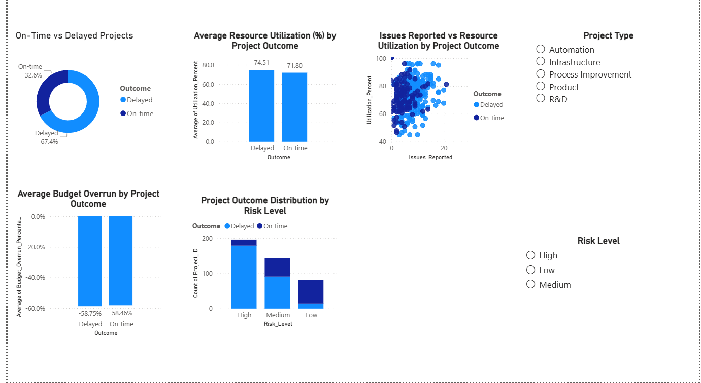

# Enterprise Resource Performance Analytics System (ERP-Integrated)

## Project Overview
This project implements an **ERP-integrated project performance analytics and decision support system**, inspired by real-world **SAP ERP project management workflows**.

The objective is to analyze **resource utilization, cost efficiency, schedule adherence, and delivery risk** using data analytics and interpretable machine learning. The solution is designed to support **engineering managers, project managers, and PMO teams** in making **data-driven decisions** across enterprise project portfolios.

The project simulates how project data extracted from an ERP system can be transformed into actionable insights through analytics, prediction models, and executive dashboards.

---

## ERP / SAP Business Context
In enterprise environments, project-related data is distributed across multiple ERP modules. This project simulates data typically sourced from SAP-style ERP systems, including:

- **SAP PS (Project System)** – project timelines, milestones, and delivery status  
- **SAP CO (Controlling)** – budget allocation, actual cost usage, and variance  
- **SAP HCM / SuccessFactors** – team size, experience, and resource availability  
- **SAP Risk Management** – risk classification and issue tracking  

The dataset represents ERP project transaction data exported from an ERP system and analyzed externally for advanced analytics and predictive insights.

---

## End-to-End Data Flow

ERP Project Data (Simulated)
→ Raw ERP Transactions (projects.csv)
→ Data Cleaning & Validation (Python)
→ Processed ERP Dataset
→ Analytics & KPI Generation
→ Machine Learning Risk / Delay Prediction
→ Management Dashboard (Power BI)

---

## ERP System Architecture (Conceptual)

SAP ERP Modules (Simulated)

• PS (Project System)

Project timelines

Milestones

Delivery status

• CO (Controlling)

Budget allocation

Cost consumption

Budget variance

• HCM / SuccessFactors

Team size

Team experience

Resource availability

• Risk Management

Risk level

Issue tracking

ERP Data Extract (CSV)
→ Data Cleaning & Validation (Python)
→ ERP Analytics Layer

KPIs & performance trends

Resource utilization analysis

Cost & schedule analysis
→ Machine Learning Layer

Delivery delay prediction

Risk classification
→ Visualization & Reporting

Power BI executive dashboard

---

## Dataset Description
- **Type:** Synthetic, industry-inspired ERP dataset  
- **Records:** 420 enterprise projects  
- **Domain:** Engineering and Project Management  

### Key Attributes
- Team size and team experience  
- Estimated vs actual effort (hours)  
- Budget allocation and actual resource cost  
- Resource utilization percentage  
- Issues reported  
- Project risk level  
- Project outcome (On-time / Delayed)  

The dataset intentionally includes missing values to reflect real-world ERP data quality challenges.

---

## Data Preparation & Feature Engineering
The data preparation workflow reflects practical ERP analytics processes.

Key steps include:
- Handling missing numeric values using median imputation  
- Handling missing categorical values using most-frequent imputation  
- Encoding ERP categorical attributes such as project type and risk level  
- Preparing analytics-ready and machine-learning-ready datasets  

Generated outputs:
- `projects_clean.csv` – cleaned dataset for analytics and visualization  
- `projects_model_ready.csv` – encoded dataset for machine learning  

---

## Exploratory Data Analysis & KPIs
Management-level KPIs derived from ERP data include:
- On-time delivery rate  
- Budget overrun distribution  
- Resource utilization trends  
- Issue frequency vs delivery delays  
- Risk level impact on project outcomes  

These KPIs help identify early warning signals during project execution.

---

## Analytics & Machine Learning Implementation

### Analytics
Exploratory Data Analysis (EDA) was performed using Python to understand relationships between cost usage, resource allocation, issues, risk levels, and delivery outcomes. Key insights were later translated into Power BI dashboards for management-level reporting.

---

### Machine Learning
- **Model Used:** Logistic Regression  
- **Objective:** Predict project delivery outcome (On-time vs Delayed)  

**Why Logistic Regression**
- Interpretable and transparent results  
- Suitable for management decision support  
- Commonly used in enterprise risk modeling  

**ML Pipeline**
- Missing value handling for numeric and categorical features  
- One-hot encoding of ERP categorical attributes  
- Train-test split (80% / 20%)  
- Model evaluation using accuracy, precision, recall, and confusion matrix  

The model functions as an ERP decision-support component by highlighting projects with higher delay risk.

---

## Model Performance Summary
- **Accuracy:** ~77%  
- Strong recall for delayed projects  
- Suitable for early-stage risk detection and portfolio-level monitoring  

---

## Power BI Dashboard – Executive Project Performance Analytics
An interactive **Power BI executive dashboard** was developed to complement the Python analytics and machine learning workflow.

The dashboard provides visibility into:
- Project delivery performance  
- Budget and cost behavior  
- Resource utilization patterns  
- Risk-driven delivery outcomes  
- Issue escalation trends  

### Interactive Features
- Project Type slicer for category-level drill-down  
- Risk Level slicer for risk-focused analysis  

### Dashboard Preview

For full interactivity, refer to:
`powerbi/ERP_Project_Performance_Dashboard.pbix`

---

## Business Value
This system demonstrates how ERP project data can be transformed into actionable insights, enabling organizations to:
- Identify delivery risks early  
- Improve planning and estimation accuracy  
- Optimize resource utilization  
- Reduce budget overruns  
- Strengthen ERP-driven project governance  

---

## Tools & Technologies
- Python (Pandas, NumPy)  
- Scikit-learn  
- Jupyter Notebook / Google Colab  
- Power BI  
- ERP / SAP-inspired data modeling  
- Git & GitHub  

---

## Future Enhancements
- Integration with real SAP project exports  
- Time-series forecasting for schedule risk  
- Advanced ensemble machine learning models  
- Automated ERP ETL pipelines  
